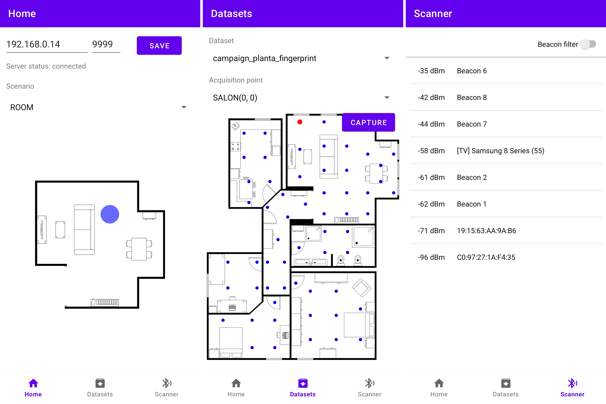
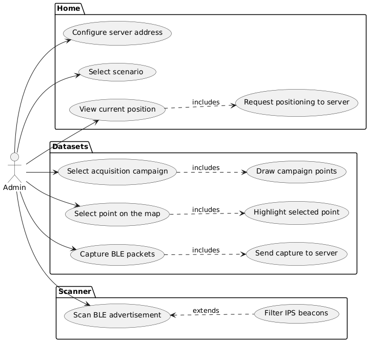

# Android app prototype for an IPS based on BLE

## Description

This repository houses the prototype of an Android application used as a client of a web-based indoor positioning service. The app has been developed in Java in the context of the following Master Thesis: https://openaccess.uoc.edu/handle/10609/150532?locale=en.

The Master Thesis showcases the development of a prototype for an indoor positioning system using state-of-the-art techniques and Bluetooth Low Energy as RF technology.

The Master Thesis is already submitted and finalized. Contributions are welcome: bug-fixing, refactoring, improvements, etc.

## Table of Contents

- [Requirements](#requirements)
- [Setup](#setup)
- [Overview](#overview)

## Requirements

- IDE: [Android Studio](https://developer.android.com/studio)
- Android SDK and retrofit2 library dependencies (managed by Gradle in the IDE)

## Setup

Simply import the project in Android Studio.

## Overview

The Android app comprises the following _Fragments_:

1. **Home**: allows for the configuration of the IP address and port number of the web server. It shows the real-time position on the selected scenario when the beacons are operative and the server is up.
2. **Datasets**: allows for the capture of RSSI samples according to the selected point and acquisition campaign. Capture time is preset in the acquisition campaign configuration, which must have been previously uploaded to the server.
3. **Scanner**: shows the list of Bluetooth advertisers received by the terminal. It allows to filter by the system beacon names.

**NOTE**: _Fragments_ Home and Datasets rely completely on the server to work (Scanner can be used standalone). The [IPS backend](https://github.com/alelince/tfm-ips) must be installed first and configured in order to use the sample acquisition and positioning services.

The following usecase diagram summarizes the application functionality:

